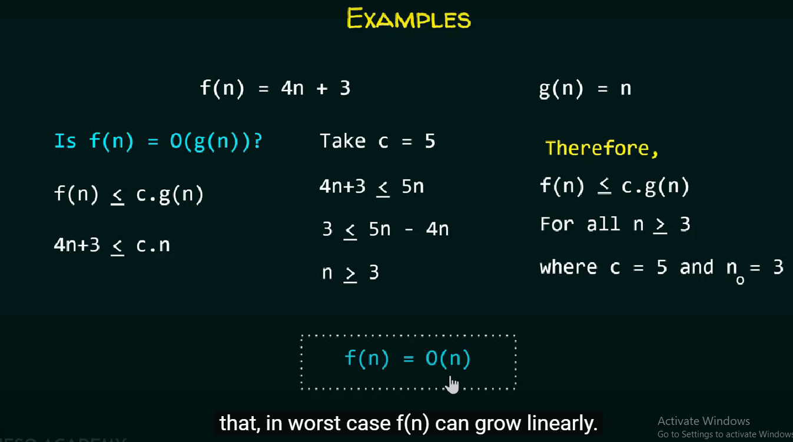
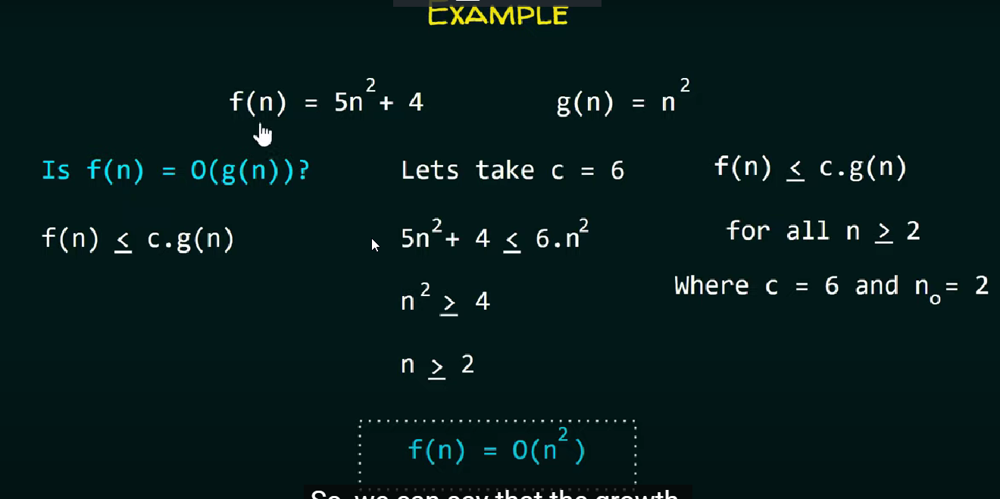

# Asymptotic analysis

## Big O notation

used to measure the performance of any algorithm by providing the order of growth of the function

it gives the upper bound on a function by which we can make sure that the function will never grow faster than this upper bound

- we want the approximate runtime of operations performed on data structures
- not interested on exact running time

- we are always insterested on the growth rate of a function
- for this purpose, we plug in different values of n into the function and plot a graph to see how it grows
- big o noation helps us in finding the growth rate of the function without plugging in different values of n

- f(n) - time complexity
- O(n) - least upper bound, how worst the algorithms can perform

> Is f(n) = O(g(n))

- is g(n) the least upper bound of f(n)?
  - f(n) <= c.g(n)

