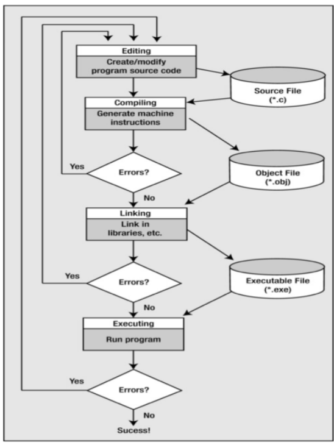

## Creating a C program

### Overview

There are four fundamental tasks in the creation of any C program

- editing
- compiling
- linking
- executing

These tasks will become second nature to you because you will be doing it so often

The processes of editing, compiling, linking, and executing are essentially the same for developing programs in any environment and with any compiled language

Editing is the process of creating and modifying your C source code

- source code is inside a file and contains the program instructions you write
- choose a wise name for your base file name (all source files end in the .c extension)
- an IDE (code blocks) will be used, but, you can use any editor (notepad, etc) to create your source code

### Compiling

- a compiler converts your source code into machine language and detects and reports errors in your code

  - the input to the compiler is the file you produce during your editing (source file)

- compilation is a two-stage process

  - the first stage is called the preprocessing phase, during which your code may be modified or added to
  - the second stage is t he actual compilation that generates the object code

- the compiler examines each program statement and checks it to ensure that it conforms to the syntax and semantics of the language

  - can also recognize structural errors (dead code)
  - does not find logic errors
  - typical errors reported might be due to an expression that has unbalanced parentheses (syntactic error), or due to the use of a variable that is not "defined" (semantic error)

- After all errors are fixed, the compiler will then take each statement of the program and translate it into assembly language

- the compiler will then translate the assembly language statements into actual machine instructions

  - the output from the compiler is known as object code and it is stored in files called object files (same name as source file with a .obj or .o extension)

- standard command to compile your C programs will be cc (or the GNU compiler, which is .gcc)
  - `cc -c myprog.c` or `gcc -c myprog.c`
  - if you omit the -c flag, your program will automatically be linked as well
- in Codeblocks we will be using a menu option from within an IDE to compile

### Linking

- after the program has been translated into object code, it is ready to be linked

  - the purpose of the linking phase is to get the program into a final form for execution on the computer
  - linking usually occurs automatically when compiling depending on what system you are one, but, can sometimes be a separate command

- The linker combines the object modules generated by the compiler with additional libraries needed by the program to create the whole executable
  - also detects and report errors
    - if part of your program is missing or a nonexistent library component is referenced
- program libraries support and extend the C language by providing routines to carry out operations that are not part of the language

  - input and output libraries, mathematical libraries, string manipulation libraries

- a failure during the linking phase means that once again you have to go back and edit your source code

- success will produce an executable file

  - in a Windows environment, the executable file will have an .exe extension
  - in UNIX/Linux, there will be no such extension (a.out by default)
  - Many IDEs have a build option, which will compile and link your program in a single operation to produce the executable

- a program of any significant size will consist of several source code files

  - each source code file needs the compiler to generate the object file that need to be linked

- the program is much easier to manage by breaking it up into a number of smaller source files
  - it is cohesive and makes t he development and maintenance of the program a lot easier
  - the set of source files that make up the program will usually be integrated under a project name, which is used to refer to the whole program

### Executing

- in most IDEs, you'll find an appropriate menu command that allows you to run or execute your compiled program

  - otherwise double-click the exefile or type a.out on the console in linux manually

- the execution stage is where you run your program
  - each of the statements of the program is sequentially executed in turn
  - if the program requests any data from the user the program temporarily suspends its execution so that the input can be entered
  - results that are displayed by the program (output) appear in a window called the
- this stage can also generate a wide variety of error conditions
  - producing the wrong output
  - just sitting there and doing nothing
  - crashing your computer
- if the program does not perform the intended functionality then it will be necessary to go back and reanalyze the program's logic
    - known as the debugging phase, correct all the known problems or bugs from the program
    - will need to make changes to the original source program
        - the entire process of compiling, linking, and executing the program must be repeated until the desired results are obtained

### C Stages

