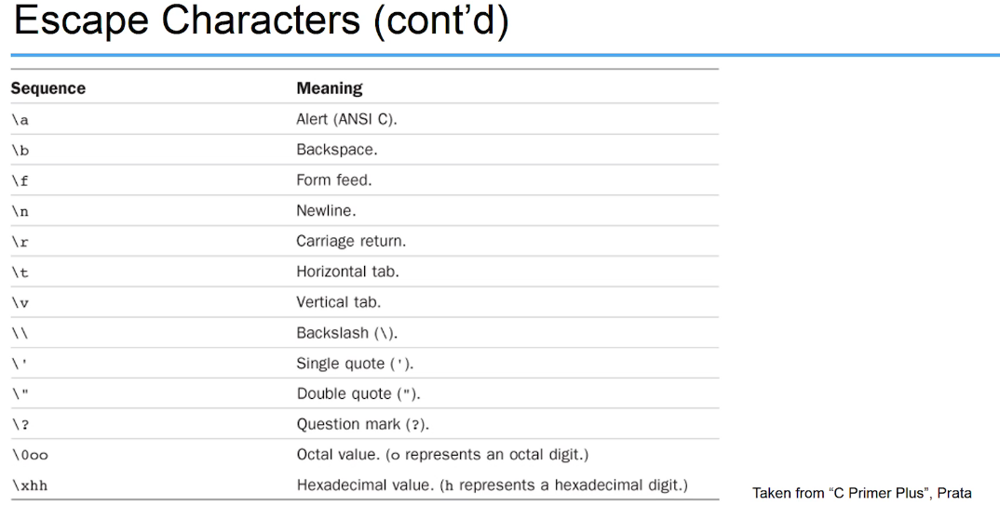

# basic data types

- `int` - signed (-infinity, 0, +infinity) - 4 bytes
- `float` - with decimal places
- `double` - higher precision than float
- `char` - character
    - use single quote (using double quote will be interpreted as strings)
    - can be assigned with numerical code of ASCII
    - can represent actions (backspace, next line, terminal bell ring, speaker beep)
        - `char x = '\n'`
        - 
- `_Bool` - 0 or 1 - 1 byte

## other (modifiers)
- `short`
- `long`
- `unsigned`
- `signed`

long long:
    ```c
    long int num = 1000L
    ```

## others
- Enums: allows a programmer to specify a set of valid values in a variable
    ```c
    enum primaryColor { red, yellow, blue };
    ```
    - to declare a variable of type enum
    ```c
    enum primaryColor myColor, gregsColor;
    ```


