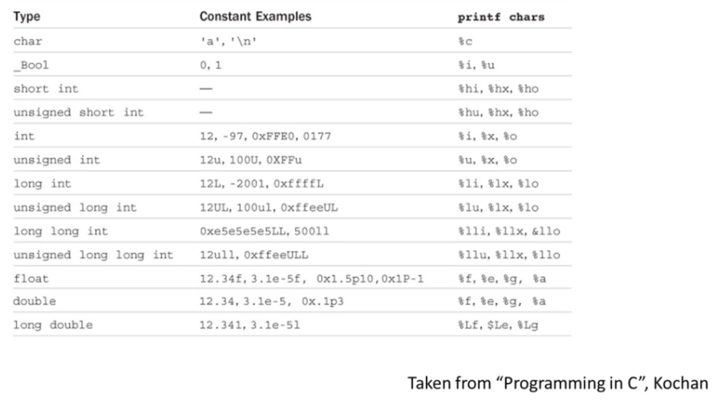

# Specifiers


```c
#include <stdio.h>

int main () {
    int integerVar = 100;
    float floatingVar = 331.79;
    double doubleVar = 8.44e+11;
    char charVar = 'W';
    _Bool boolVar = 0;

    printf("integerVar = %i\n", integerVar);
    printf("floatingVar = %f\n", floatingVar);
    printf("doubleVar = %e\n", doubleVar);
     printf("doubleVar = %g\n", doubleVar);
    printf("charVar = %c\n", charVar);
    printf("boolVar = %i\n", boolVar);

    return 0;
}

```

- to specify precision you can use `%0.2f` for 2 decimal places

## Summary

-   `%zd` - size

