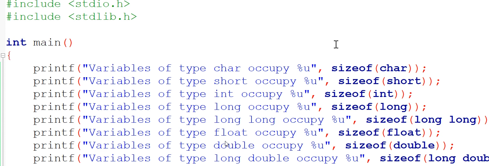

# Cast and sizeOf operators

## Cast

Converts a value explicitly to defined data type (int, float, double, )

```c
#include <stdiio.h>

int main () {


    printf("%i", (int)21.51 + (int)26.99) // 21 + 26
}

```

## sizeOf operator

Find out how many bytes are occupied in memory by a given type
- special keyworkd in C
- operator not a function
- valid arguments: variable, array, basic data type, derived data type, expression
- use sizeof operator wherever possible to avoid hardcoded sizes

Example


## Others

- `*` - pointer
- `?` - used for comparison; ternary operator
